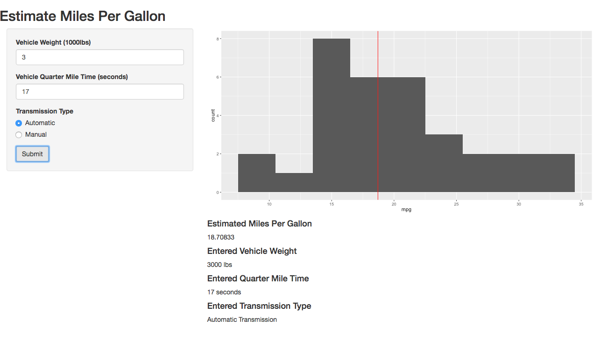

<!-- Limit image width and height -->
<style type='text/css'>
img {
    max-height: 560px;
    max-width: 964px;
}
</style>

<!-- Center image on slide -->
<script src="http://ajax.aspnetcdn.com/ajax/jQuery/jquery-1.7.min.js"></script>
<script type='text/javascript'>
$(function() {
    $("p:has(img)").addClass('centered');
});
</script>

## Why Predict Mileage

- Vehicle mileage is of increasing importance to consumers
- Understanding the tradeoffs for mileage can determine whether or not a particular set of constraints is reasonable early in the design process
- A simple prediction algorithm can greatly reduce the time needed to iterate over design consederation.

---  

## What do you need

This simple prediction algorithm uses the vehicle weight, quarter mile time and transmission type to predict the miles per gallon.  

If we wanted to evaluate a new set of data, such as a vehicle that weighs 3000lbs, has a quarter mile time of 17 seconds, and an automatic transmission, we could do the following: 


```r
x <- data.frame(wt=3, qsec=17, am=0)
value <- predict(model, newdata=x)
value
```

```
##        1 
## 18.70833
```
Resulting in 18.71 miles per gallon.

Alternatively, we could do the same through a convinient web application.

---

## How does it look




---

## Summary

- Predicting Mileage is useful in the design stage of vehicles
- Simple predictions can suggest whether or not a design is worth pursuing
- A simple web interface provides a convinent way to enter the required information and get the results
- A simple prediction algorithm runs with minimal overhead

